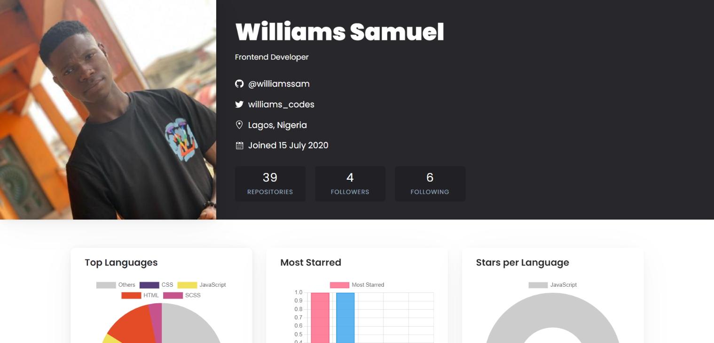

# Github Profile - a better look at your profile

My goal was to create an app to look at your github profile with graphs.

## Getting Started

NB: Install "yarn" if you have not, using
<code>npm install --global yarn</code>

1. Install dependencies  
   <code>yarn</code>

2. Start the server  
   <code>yarn start</code>

## How I worked on this project

-   I built this app with design inspiration from Britanny's original design
-   I used styled components for styling, gh-polyglot to get repo details, and flip move for the flip animations.

## How to navigate this project

-   Each individual components can be found inside the components folder
-   Gloabl styles can be found in the globalstyles folder
-   I seprated the styles from the logic, you can find the styles in the styles folder under components

## Why I built the project this way

-   I used "styled-componenets" because it is a great library for styling. it includes an auto-prefixer and allows me to use Javascript for styling.
-   The application fetches data from the Github API
-   Uses the GhPolyglot to fetch user repos and the user repo lanagues details

## Credit

Original idea by [Britanny Chang](https://github.com/bchiang7/octoprofile)
